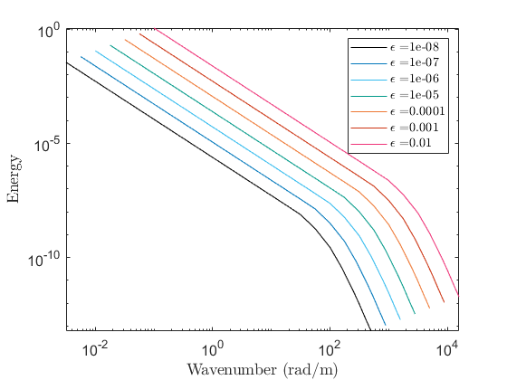

# Internal Waves Energetics Calculations

These scripts are designed to calculate TKE dissipation from PIV fields, Written by Peter Sutherland for the Hydralab Internal Waves project [published in GRL](https://doi.org/10.1029/2019GL084710). The primary objective was to study internal solitary wave propagation in ice covered waters. The scripts have now been modified by Sam Hartharn-Evans for extended use in the Novak Laboratory, and for advanced energetics analysis to study internal solitary wave propagation in ice-covered waters. 

## Script usage ##

TODO Stuff: sort stuff

## Find Boundaries
The script [`find_boundaries`](./find_boundaries.m) finds the location of the pycnocline and/or ice. In the case of ice, it can be used to mask that part of the flow. In both cases, a brightness threshold is used, although this is much more fiddly to find for the ice. 

## Calculate APE
The script [`dfi_ts2APE`](./dfi_ts2APE.m) calculates APE density (J/m) from a column timeseries image using the method of Boegman et al. (2005). JFM, 531, 159-180. .
Pycnocline location calculated from find_boundaries, pycnocline location tool, then smoothed. 

APE calculated as:

$$APE = cg * \Delta\rho * \int_{t_0}^{t_1}(\eta^2) dt$$

TODO: 
[ ] Optional input of reference $z$, rather than $\eta(0)$

## Dissipation
Running [`calc_dissipation`](./calc_dissipation.m) produces structures with the various calculated dissipation, both spectral and direct, and using 1 & 2D.

### Direct
We can calculate dissipation directly, using the Direct estimate version of [Doron et al. (2001)](https://doi.org/10.1175/1520-0485(2001)0312108:TCADEI%3E2.0.CO;2), assuming isotropic turbulence:

$$    \epsilon_d = 3 \nu \Biggl[ \Biggl< \left(\dfrac{\delta u}{\delta x}\right) ^2 \Biggr>  +  \Bigg \langle \left(\dfrac{\delta w}{\delta z}\right) ^2 \Bigg \rangle  + \Bigg \langle \left(\dfrac{\delta u}{\delta z}\right) ^2 \Bigg \rangle + \Bigg \langle \left(\dfrac{\delta w}{\delta x}\right) ^2 \Bigg \rangle + \\
    2 \Bigg \langle \left(\dfrac{\delta u}{\delta z} \dfrac{\delta w}{\delta x}\right) \Bigg \rangle + 4/3 \Bigg \langle \left(\dfrac{\delta u}{\delta x} \dfrac{\delta w}{\delta z}\right) \Bigg \rangle \Biggr]
$$

The bit of code to do this is [`dissipation_gradient_2D`](./dissipation_gradient_2D.m), typically called from `calc_dissipation`, but can be used directly with inputs of _U, V, dx, dy, and $\nu$_. 

The "Direct" parts of calc_dissipation are _e_dir_. The following parts:
- _e\_dir.x_ \& _e\_dir.y_: grids corresponding to direct dissipation estimates
- _e\_dir.e\_1dx \& e\_dir.e\_1dy_ : dissipation rate for homogeneous isotropic turbulence calculated as $$15\nu (\frac{du}{dx})^2$$ or $$15\nu (\frac{dv}{dy})^2$$ respectively.
- _e\_dir.e\_diff_ : Average dissipation across the image
- _e\_dir.e\_image_ : Direct estimate as in equation above
- _e\_dir.e\_filt_ : A window-mean filter applied to _e_dir.e_image_
### Spectral
Various forms of these exist in 1D and 2D. Essentially, these calculate the power spectra of the velocity data [`spec2_ps_nopad.m`](./spec2_ps_nopad.m)/ [`spec_ps_nopad.m`](./spec_ps_nopad.m) and calculates the value of $\epsilon$ which closest fits the observed spectrum:

## Plotting dissipation ##
Plotting can be done simply via the _grd_ structure output by `calc_dissipation`, but primarily is through [`plot_dissipation`](./plot_dissipation.m). With inputs of:
- _parameters_ : Structure containing which parameters to plot, from list "direct_windowed" (, "direct_unwindowed", "spectral", "profile", "piv" and "rawimage"
- _settings_ 
