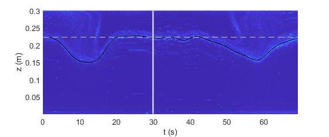

# Hydralab Internal Waves Turbulence Calculations

These scripts are designed to calculate TKE dissipation from PIV fields, Written by Peter Sutherland for the Hydralab Internal Waves project. The primary objective was to study internal solitary wave propagation in ice covered waters. The scripts have now been modified by Sam Hartharn-Evans for extended use in the Novak Laboratory to study internal solitary wave propagation in ice-covered waters

## Script usage ##

To calculate x-z-dissipation plots, open the script `turbulence_stats.m`.  In
the USER INPUTS section near the start, you will need to:
1) Change the folder where the .dfi data files are stored.
2) Un-comment the ice type that you would like to plot (and comment the
others).
3) Run the script to make the plots.

The summary plots for publication are then produced by `plot_dissipation_profile.m` in the same folder.

Note: Matlab rasterizes the plots before saving them in pdf of epsc format because the plots were produced using pcolor.  The rasterization results in a resolution inferior to the .png version.  Consequently, the .png version is reccommended for publication.

## Horizontally averaged dissipation profiles ##

Horizontal averaging of TKE dissipation is performed in `plot_dissipation_profile.m` as follows:

- Data from within 0.1m from each side of the plotted FOV (figure 5 in article) was discarded to remove potential edge effects from the PIV algorithm.  To visualize the generally low sensitivity of the results to the amount of edge cut off, produce figure 1111 with various different values of xr_min and xr_max (the amount of edge trimmed at the lower and upper ends of the figures).

- At each depth level, all remaining data were averaged to provide a single average dissipaiton \overbar{\epsilon} at that level.

- Figure 5, panels d, h, l, as well as the right panel in figure 1111, show that average epsilon.

## Dissipation in ice vs. pycnocline layers ##

Horizontally averaged dissipation was calculated for each of the three ice types over the full water column (panels d, h, and l in Figure 410).  This horizontally averaged dissipation was then vertically integrated over two different layers of increased dissipation: 1) The near-ice layer, and 2) the pycnocline layer.  The limits of integration for the two regions were chosen as follows:

- Ice layer top: water surface
- Ice layer bottom: the first local minimum of dissipation reached when travelling downwards from the near-surface dissipation peak.
- Pycnocline top: The first local minimum reached when travelling upwards from the pycnocline dissipation peak.
- Pycnocline bottom: Either 1) The first local minimum in dissipation reached when travelling downwards from the pycnocline peak in dissipation. or, 2) The lower limit of the domain, y=0.2m.

The values found were as follows (in units m3/s3 x 10-6):

|        | Near-ice | Pycnocline | 
| ------ |:--------:|:----------:|
| Grease | 2.4 | 3.1 |
| Nilas  | 2.8 | 4.4 |
| Level  | 1.5 | 2.8 |

## dfi_ts2APE
This script calculates APE density (J/m) from a column timeseries image using the method of Boegman et al. (2005). JFM, 531, 159-180. doi:10.1017/S0022112005003915.
Pycnocline location calculated from find_boundaries, pycnocline location tool, then smoothed. 

APE calculated as:

$$APE = cg * delta_rho * int_t0^t1(eta^2) dt$$

