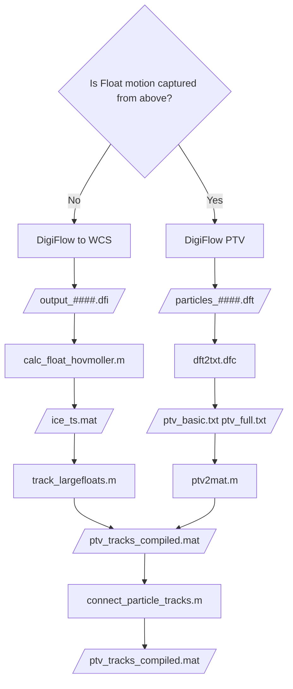

## Particle Tracking Codes
Tools are provided here for the purposes of tracking surface particles and producing a coherent .mat structure describing them, either via post-processing of DigiFlow PTV output, or from digiflow images. See the following flow chart to identify the process:

`calc_float_hovmoller.m` 
    Outputs a .mat structure with a Hovmoller plot of raw image at a specific row, with ice detection on, to identify the edge of ice. 
    
`track_largefloats.m`
    Tracking code for the edge detection in the Hovmoller plot. Outputs a .mat structure of particle location + speed through time.
    
`connect_particle_tracks.m`
    Joins together particle tracks that belong to the same particle, including across directories (e.g. CamA, CamB and CamC). Requires user input to identify which lines to join. Common pathway between ptv and matlab methods.
